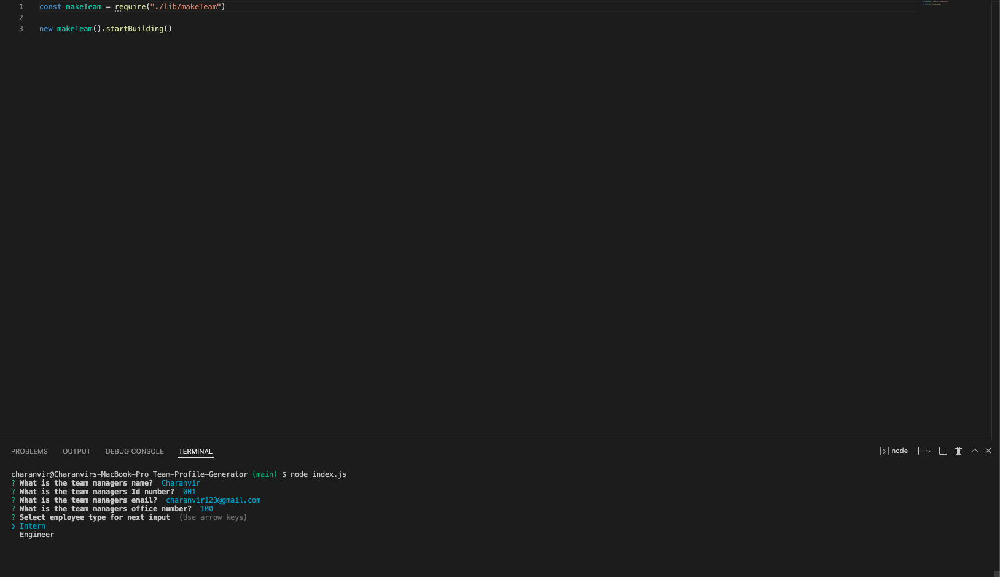
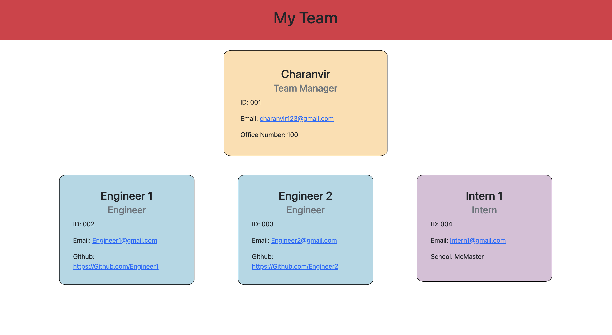

# Team Profile Generator

  

## <u>Table of Contents</u>
1. [Description](#description)
2. [Installation](#installation)
3. [Usage](#usage)
4. [Contributing](#contributing)
5. [Testing](#testing)
6. [Questions](#questions)
7. [License](#license)

## Description
***

A Node.js command line application that takes in information about employees on a software engineering team and generates an HTML webpage that displays summaries for each person.

The motivation behind this application is giving the user an easy to use application which allows them to quickly generate a webpage and see the information pertaining to their employees. 

## Installation
***

To install this application get the repository link from above, either via an HTTP or SSH link. 

```
git clone 
```

Once you have the repository cloned to your local machine, navigate to the root of the repository in your terminal.

```
npm install
```

This will install all the necessary dependencies that are needed for the application to run.


## Usage
***

To use this application, navigate to the root of this repository in the terminal and enter the following command 

```
node index.js
```

The user will be prompted with a series of questions that will be used to generate a Team Profile webpage.

The following images show the prompt that is displayed on the command line and a sample webapge generated using the application.

 

The following is a link to a video which shows how the application is used: [Team Profile Generator Walkthrough Video](https://vimeo.com/699325065)

## Contributing
***

To contribute to this application, push any enhancements and changes you code and send an email to charanvir123@gmail.com. The developer will get back to you if they wish to implement any of the code changes you've made. 

## Testing
***

Testing has been implemented using the node package "Jest" Use the following command to test whether the files are correctly working. This command must be ran within the applications directory.

```
npm run test
```

There should be 4 Test Suites that are ran and passed, along with 18 individual tests that should all pass as well. 

## Questions
***
To view more projects visit this [Github](https://github.com/Charanvir) account.

Direct any additional questions you have regarding this application to charanvir123@gmail.com

## License
***
The following application is covered under the MIT License
